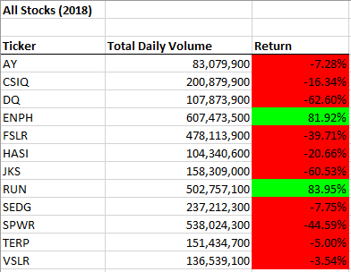
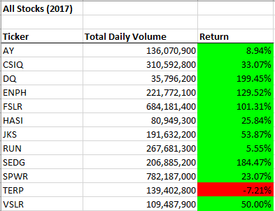

# Stock Analysis 
Analysis of “green” stocks by comparing values for the years of 2017 and 2018. 

## Project Overview
In this project, analysis of “green” stocks has been conducted by comparing values for the years of 2017 and 2018. By creating a macro, the process is automated and scalable.
With the press of a button, the ticker, total volume, starting price and ending price are displayed and evaluated for profitability.

## Tools
Excel, VBA 

## Summary

- Formatted the output sheet on the “All Stocks Analysis” worksheet. The macro name is “AllStocksAnalysisRefactor”.

- From the stock’s analysis of the year 2018, it is found that except “ENPH” and “RUN” all other stocks are not performing well.

- From the stock’s analysis of the year 2017, it is found that except “TERP” all other stocks are performing well. The stocks of “DQ”, “ENPH”, “FSLR” and “SEDG” are even having return more than 100 percentage.

- By using this code, we can find the total volume and the yearly return for any given year if we have the necessary data.
